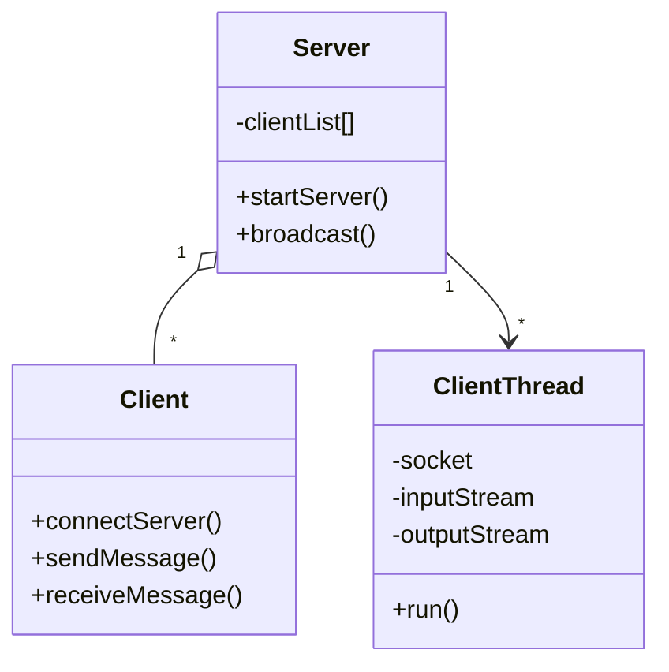

# Chat Application (Java Sockets)

### Author: Kathiravan S P  

### Tech Stack: Java, Socket Programming, OOP
---
## About
  - A real-time chat application built using Java sockets that allows multiple users to communicate with each other through a client-server model.  
  
  - This project demonstrates networking in Java, object-oriented principles, and modular code design.

## Who It’s For

* Students learning Java Networking

* Beginners exploring client-server architecture

* Developers who want to understand multithreading in Java

* Anyone looking for a simple messaging app in Java

## How It Works

+ Server – Listens for incoming client connections and manages broadcasting messages.

+ Client – Connects to the server and enables users to send/receive messages.

+ Multi-threading – Each client runs in a separate thread, ensuring real-time communication.

+ OOP Concepts – Uses Encapsulation, Inheritance, and Polymorphism to design the system.

 ## Features

1)  Real-time text messaging

2) Supports multiple clients simultaneously

3) Handles clean client disconnections

4) Simple and lightweight Java console interface

## Target Users

### Students & Classrooms
- Useful for group discussions or study groups.  
- Example: A teacher runs the server, students connect as clients and chat.  

### Small Teams / Offices
- For quick communication without needing big apps like WhatsApp or Slack.  
- Lightweight and private within a LAN (local network).  

### Developers / Learners
- Helps in understanding networking, sockets, and OOP in Java.  
- This project acts as a foundation for building larger messaging systems.

## UML Diagram

